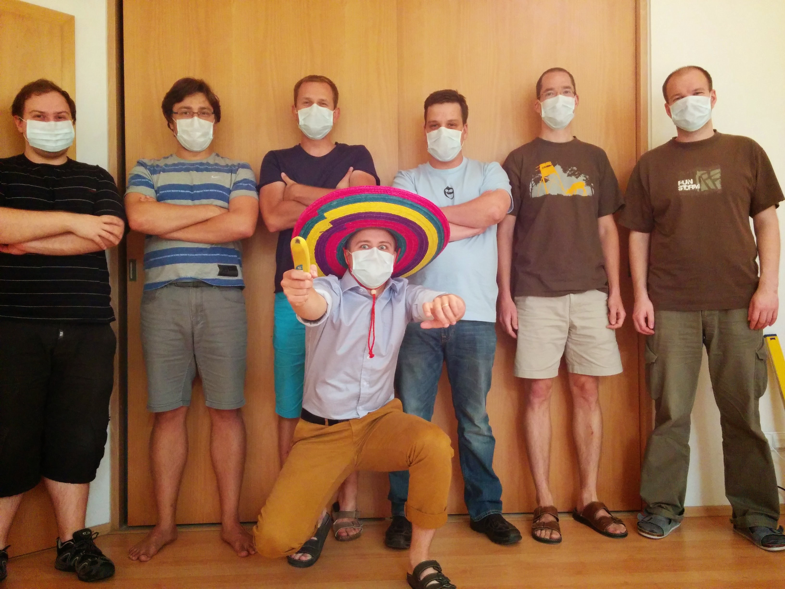
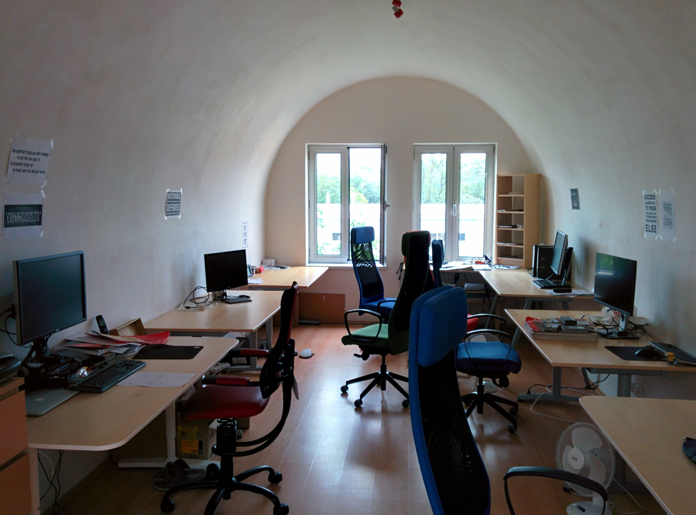

> I wrote this piece for [Showmax Engineering Blog](https://tech.showmax.com). As I am about to embarque onto new ventures, I wanted to preserve this piece. I played an essential role in bringing Showmax Engineering to where it is now.

> I've started this article for our newcomers to help them understand better what is happening around them and set the expectations. Transparency is a very important piece of our culture. So why not to share it with everybody?

This document tries to be the "FM" from the "[RTFM](https://www.urbandictionary.com/define.php?term=RTFM)". It describes how I envision Engineering working together and with other teams within the company. Basically, it’s all about being able to have meaningful interactions together. This document is not intended to replace the relationship and trust we build as we work together, rather it’s intended to give you an idea of how do I think and what type of culture we are trying to build within Showmax Engineering.

# How did I get here?

I’ve been always into electronics and computers - especially computer networks. These interests naturally brought me to the idea of building [Silicon Hill](https://www.sh.cvut.cz) and working at PragoNET/T-Systems/Deutsche Telekom. I was also very lucky for the opportunity I received during my Ph.D. work, having spent quite a lot of time at CERN working on the COMPASS experiment, BNL (Brookhaven National Laboratory), and RIKEN. While all of them are high-energy physics labs, I was working on computers - specifically, distributed storages and computing clusters.

After all of this, I joined Xeris. Our mission was to build a solution for recording linear TV all around the globe. It was 2004, so it was a revolutionary idea at that time - which is probably why it was quickly shot down by studios. But, before it was shuttered, we were able to develop some cool stuff like a distributed, stream-oriented file system. This company then transformed into nangu.TV which is still around and is producing an IPTV platform for telcos and related.

I stayed until 2013, when I decided to move forward. I got into machine learning and started a company with a couple friends from my studies at the Czech Technical University. That company, [Recombee](https://www.recombee.com), is actually still around and doing pretty well.

But, during that period I was approached by two guys from Dubai. They had a vision of building a Netflix-like service for the Middle East. It sounded compelling as I was already familiar with the problem space and the very interesting challenges of building a potentially large B2C distributed Internet platform. The first colleague I hired was Jirka Brunclík, who brought Karel Durdis and Adam Činčura (I am very grateful that they are all still with us). The four of us basically built the bare-bone platform in about 3 months. We had to rush, as Ramadan was coming up and time was tight. This all happened in our now-famous flat in Beroun.

 *Getting ready to fight a common cold*
 *Central section (room) of the flat*

Unfortunately, around the end of 2014, we had reached a point where the business was not really sustainable. We were all getting ready to just close up shop - there were roughly 8 of us then, the majority of whom are still with us) - when something interesting happened: we met John Kotsaftis of Naspers. John fell in love with our work and saved us. Now, we’re Showmax Engineering.

We launched our service in South Africa in August of 2015. Since then, we’ve expanded our service to other [SSA countries](https://en.wikipedia.org/wiki/Sub-Saharan_Africa), the wider [diaspora](https://blog.showmax.com/press-release-showmax-delivers-vias-best-shows-afrikaans-viewers-worldwide/), and to [Poland](https://blog.showmax.com/showmax-expands-service-europe/). Now, we’re talking about adopting a freemium model and becoming an important player for regional independent media. We’ve also grown from 8 people to about 85, spread across 4 locations (ok, I admit, AMS and JHB is a bit cheating as we have just one guy in every location, but still...).

# My role within the organization

I'm primarily here to:

1. **Listen & Observe**: I’m in a unique position that allows me to connect loose ends, and keep a high-level understanding of what we’re doing and how we’re doing it. and how we are doing.
2. **Context & Vision**: I try to ask and answer as many "Why?" and "How?" questions as I can, and share ideas across teams.
3. **Talent:** I want to engage, nurture, and retain world-class talent (that's you!)
4. **Company Diplomacy**: I act as a bridge between the Engineering team and management of the wider company.
5. **Culture & External Relations**: I nurture our internal team and company cultures, as well as how the outside world sees us.
6. **Technology**: I like to understand how things work, and I like to keep them working. That means keeping our overall platform architecture clean, slick, and scalable.
7. **The Future**: What are we going to do next and how are we going to do it?

A big part of all of these things is empowerment. I want to, and *should be able to*, just pack up and leave for the month without people noticing. That means:

* You understand **why** we’re doing what we’re doing. You have enough context to define and track your priorities for the next month or quarter.
* You feel empowered as a leader (in this case, a "leader" is anybody who is able to influence other human beings) to figure out what you need to do and how you think it should be done - and then to do it.
* You have built effective relationships with others in the company.

Every single person in Engineering is important. "Culture" has become an overloaded term, but it matters and I think of it as a tool for having better organization. Obviously, the best and closest sources of information and context are your own team and tech leaders. They overlook the whole team and maintain that crucial high-level overview of what’s happening - and they’re super important for maintaining a healthy team and company culture. In fact, everyone has an important role here - if you think that we are missing something, say it. Raise your voice, talk to that person, talk to your team-lead, talk to Karel, talk to Linda, talk to me. It doesn’t matter, who you talk to, but say/do something about it.

# Team

My Ideals for teams and team members are actually pretty straightforward:

* Take control of, and responsibility for, our own destiny
* Have each other’s back
* Hold each other accountable and provide constructive, unbiased feedback
* Strive for excellence for yourself and help others with the same
* Keep the bigger picture in your mind
* Assume the positive intent of the others, and always have positive intent towards others
* Always ask questions; always ask "why?"
* Context, context, context - Some words can have different meanings for different people. Understand your audience.
* Constantly learn and laugh together

# Communication

Communication within our team and with the rest of the company (business, product, content, customer care, etc.) and even the outside world (blog, conferences etc.) is crucial. Our most critical information resource is Phabricator (which is not always true for teams outside Engineering). Please **pay attention to details**. For example, state of the ticket, it’s **priority**, and attached **tags** are all important signals for other people working with the ticket. Task **hierarchies** are also super important, as it’s way easier to navigate through tickets with defined relationships than it is to wade through an unstructured pile. Also **typography** is important for improved readability. Spend an extra couple of seconds to [format](https://secure.phabricator.com/book/phabricator/article/remarkup/) your descriptions and comments.

Mature communication doesn’t mean no conflict. **Good ideas do not come from agreeing with each other all the time** - ideas need to be examined and challenged to achieve excellence. Question the status quo, ask why we should be doing certain things, don’t blindly accept solutions provided to you. Think about them, evaluate them (do they fit the context / purpose?), and be ready and willing to abandon your own ideas and preconceived notions!

## Transparency & Feedback

> A **post-mortem** (or postmortem) is a process intended to help you learn from past incidents. It typically involves documenting, analysing and discussing the event very soon after it has taken place. It is strictly blame-less, it describes what happen, what was done do mitigate the problem and what will be done to prevent event repeating itself it the future.
>
> **Engineering Highlights** is a weekly newsletter sent every Friday. It summarizes key achievements, events and learnings from that particular week. We try to write it in the way that it helpful for other engineers as well as other people within the organization.
>
> **AMA** also known as **Ask Me Anything** is videocast which I co-host with Jirka. It started (hence the name) with series of questions for myself to answer, but it evolved into platform where we also bring guests to talk about technical and non-technical topics relevant to our operations.
{: style="width: 33%; float: right; margin-left: 1.6em; margin-top: 0;"}

One day, I would love to be running Deliberately Developmental Organization (DDO) organization. We’re not there yet, but giving and receiving feedback is super important.

One of the key building blocks of any DDO organization is transparency. Ray Dalio calls it "[radical transparency](https://www.inc.com/gene-hammett/3-steps-ray-dalio-uses-radical-transparency-to-build-a-billion-dollar-company.html)". While we may not be at the *radical* part just yet, I want to get there. Being able to receive feedback (both positive and negative) is critical for your own growth as well as the growth of the team as a whole.

Here are a couple of real-world examples of what I mean:

* **Bad Meetings**: You’re in a meeting and it’s obvious that people are just rambling on, unprepared. Call it out - give the feedback that it could have been way more productive if they actually prepare for it.
* **Ask For Clarification**: You came across an confusing or unclear comment in Phabricator. Reach out to the author (e.g. via Slack) and ask them to clarify. Go further, help the original author to augment the comment! Everybody wins.
* **Feedback Loops**: You have received feedback on something that is quite common in your team. Share that feedback with other team members, as it will probably resonate with them as well.
* **Knowledge Sharing**: Something broke down. You were troubleshooting it, spent the extra effort, and write a proper *post-mortem* report (if you work here, check `phab/w/postmortems/`). We’ll typically include it into that week *Engineering Highlights* so other people can learn. We may also touch it during AMA.

Please go and listen to [Adams Grant's podcast episode with Ray Dalio](https://www.ted.com/talks/worklife_with_adam_grant_dear_billionaire_i_give_you_a_d_minus). Seriously. Listen to it. Please just listen to it.

## Reaching Out

Very few things are more important than talking to you if you want to talk to me. If you need to talk, let’s talk. Heard a rumor? Need clarification on something? Not getting the answer from your team lead? Stop me in the hall, shoot me a Slack message or an email (typically the best). Something urgent? Just give me a call.

Feel free to put something in my calendar, don’t feel like you need to ask first. Is my calendar full? Send me a message and I’ll very likely be able to move something around.

## What to read next?

To learn more about DDO and about the value of honest feedback check out

* [Episode of Adams Grant's podcast with Ray Dalio](https://www.ted.com/talks/worklife_with_adam_grant_dear_billionaire_i_give_you_a_d_minus)
* [Ray Dalio - Principles (book)](https://www.amazon.de/Principles-Life-Work-Ray-Dalio/dp/1501124021/)
