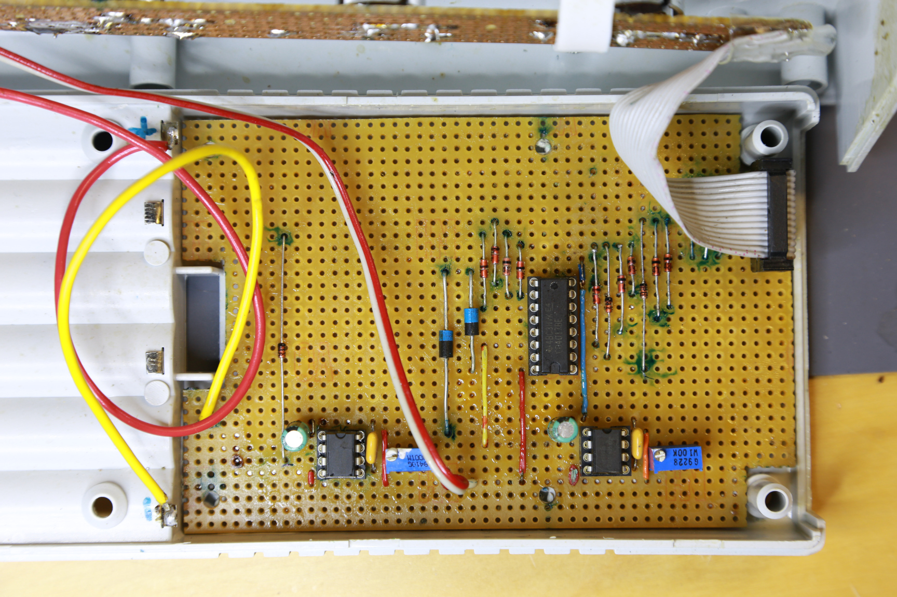
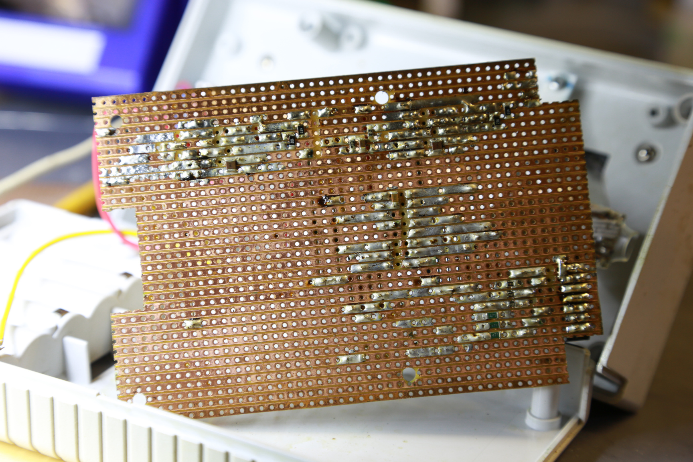
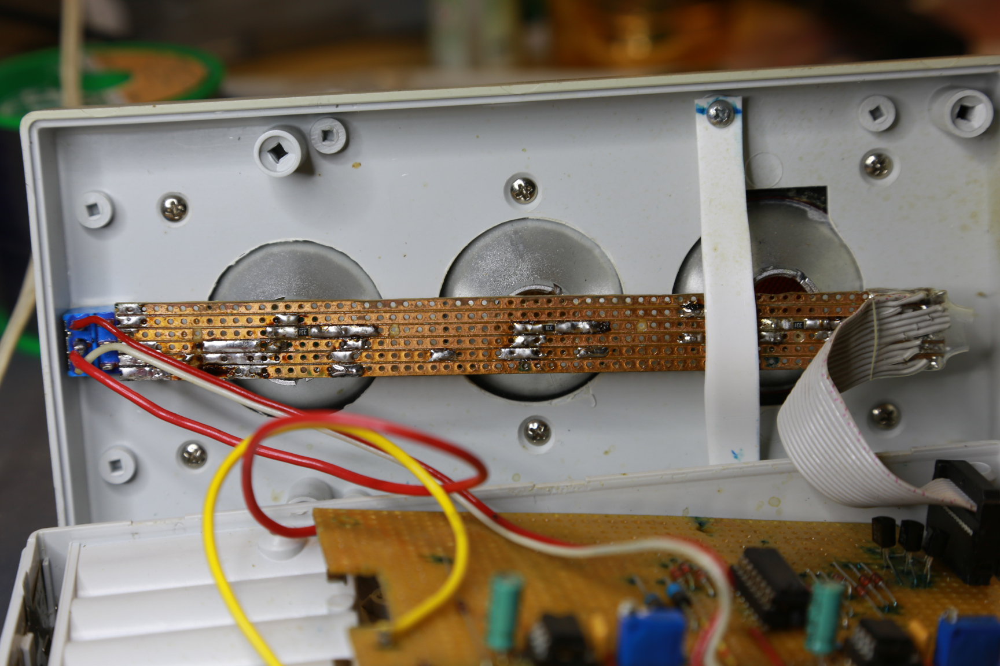

Kids needed a working traffic light for one of their games. I took it as a good reason to hide in the workshop and produced one showed on the video below.

<iframe width="840px" height="356px" src="https://www.youtube.com/embed/5nYlYqhAlMA" frameborder="0" allow="accelerometer; autoplay; encrypted-media; gyroscope; picture-in-picture" allowfullscreen></iframe>

This is super-simple project, why to write a post about it? You may ask. Initial temptation was to grab some small MCU (or even Arduino as that is basically ready to use for such project). But I have opted for old-fashion way withou using MCU and rather some combination logic.

 _Traffic light schematics ([PNG](traffic_light/schematics.png), [PDF](traffic_light/schematics.pdf))_

As you can see, there are 3 main sections:

- shared output section with transistors driving the color LEDs
- single `NE555` generating pulses for yellow warning mode
- another `NE555` driving counter to run a "program" for a full cycle

You can think about the `CD4017` counter as being a step counter, which points into lookup table to resolve into desired LEDs state. Lookup table is realized with set of signal diodes, which just pass 1 when needed (and not allow current to pass back to gate and/or drive other LEDs). Length of the step is determined by `NE555` output frequency.

Programming table is simple:

| Step counter / Pin active | Active LEDs  |
| ------------------------- | ------------ |
| `Q0`                      | red          |
| `Q1`                      | red          |
| `Q2`                      | red          |
| `Q3`                      | red          |
| `Q4`                      | red + yellow |
| `Q5`                      | green        |
| `Q6`                      | green        |
| `Q7`                      | green        |
| `Q8`                      | green        |
| `Q9`                      | yellow       |

Wiring of diodes directly follows the table above and connects counter output pins `Q*` to appropriate transistors' base to drive LEDs. I have not designed PCB at the end as construction was simple and one-off.

 _All components on a perfboard_

 _Bottom of a perfboard_

 _LEDs assembly_
