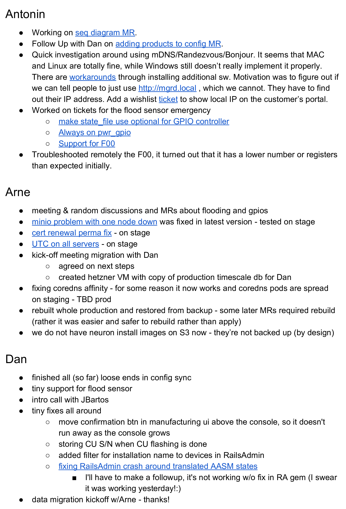

Written standup is a simple tool that can significantly improve how distributed teams work. It's just what it sounds like: instead of meeting to talk, team members write down what they're doing. This has several benefits. It creates a searchable record of what everyone's working on. It helps people catch up if they miss a day. And it gives you a sense of accomplishment, which can be hard to get in knowledge work.

The best way to do the written standup is to treat it like a log. Update it throughout the day as you work. This makes it easier to remember what you did, and helps your teammates stay current. Written standup increases visibility into what everyone's doing. It improves accountability by making clear what each person should be working on. And it enhances communication by giving people a place to share updates and ask questions.

Here are some of the benefits of written standup:

- **Increased visibility:** Written standup gives everyone on the team visibility into what everyone else is working on. It keeps everyone on the same page and working towards the same goals.
- **Improved accountability:** Written standup helps to improve accountability by making it clear what everyone is supposed to be working on. Makes sure that everyone is contributing to the team's success.
- **Improved communication:** Written standup helps to improve communication by providing a forum for team members to share updates and ask questions. This helps to keep everyone in the loop and reduces the chances of misunderstandings.

If you are a distributed team, I highly recommend using written standup. It is a simple tool that can have a big impact on your team's productivity and effectiveness.

## How to Do Written Standup

Written standup[[sidenote Can we call it standup, if you are sitting, when writing it? Maybe it should be called *situp* or standing desks have to be required.]] is a simple process. Here are the steps involved:

1. Simple automation creates a fresh standup document during the night.
1. At the beginning of each day, each team member writes a short update about what they plan to work on that day.
1. The updates are then shared with the rest of the team.
1. At the end of the day, each team member writes a short update about what they've actually worked on and what they plan to work on the next day.

That's it! Written standup is a simple process that can have a big impact on your team's productivity and effectiveness.

## Tips for Effective Written Standup

Here are some tips for effective written standup:

- Keep your updates short and to the point.
- Share links to the relevant resources (tickets, code, merge-requests).
- Be specific about what you plan to work on and what you actually worked on.
- Be honest about your progress.
- Be open to feedback from your teammates.

With a little practice, written standup can become a valuable tool for your team.

 *Example page from a written standup document of an IoT project.*
