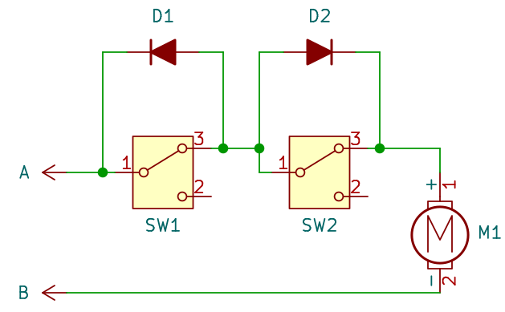

Our chicken coop door is controlled by an ESP8266 board running Tasmota. Tasmota allows for simple configuration of timers based on sunrise and sunset using timezone information. The door movement is achieved by a DC motor with a string, which pulls the door up. We utilize Tasmota's [Shutters and Blinds](https://tasmota.github.io/docs/Blinds-and-Shutters/) feature. The motor is controlled by a simple H-bridge (the initial version used cheap relays, but proved unreliable, especially during winter). The standard configuration of the blinds and shutters module uses time to define fully open and fully closed positions. However, this proved unreliable as the motor's gearbox requires slightly different times depending on the outside temperature. Additionally, the system cannot easily recover from manual interventions (e.g., someone moving the door by hand).

To improve reliability, we need to add limit switches to detect fully open and fully closed positions. This will allow us to stop the motor when it reaches the limit. While signals from the switches can be wired back to GPIO pins on the ESP8266 and Tasmota can be configured to stop the motor when a switch is activated, there is a simpler solution using just two diodes.

 _Motor midway through its travel_

The motor's direction is controlled by the polarity of voltage on terminals `A` and `B`. The schematic shows the door midway through its travel. Both switches are not activated, and they pass current as we have wired them in series using normally closed contacts (`NC`).

There are two possible states:

1. `A` is positive and `B` is negative:
   - `D1` is reverse biased and blocks current flow. However, `SW1` is not engaged, so current flows through it. `D2` is forward biased and allows current flow, but `SW2` is not engaged, so it's irrelevant. The motor runs in one direction, towards `SW1`.
   - When the door hits `SW1`, it opens, and current stops flowing as `D1` blocks the current flow (since `A` is positive). The motor stops.

2. `A` is negative and `B` is positive (moving in the opposite direction towards `SW2`):
   - `D1` is now forward biased and allows current flow, bypassing `SW1`. `D2` is reverse biased, but it doesn't matter as `SW2` is closed. The motor runs in the opposite direction, towards `SW2`.
   - When the door hits `SW2`, it opens, and current stops flowing as `D2` blocks the current flow (since `A` is negative). The motor stops.
