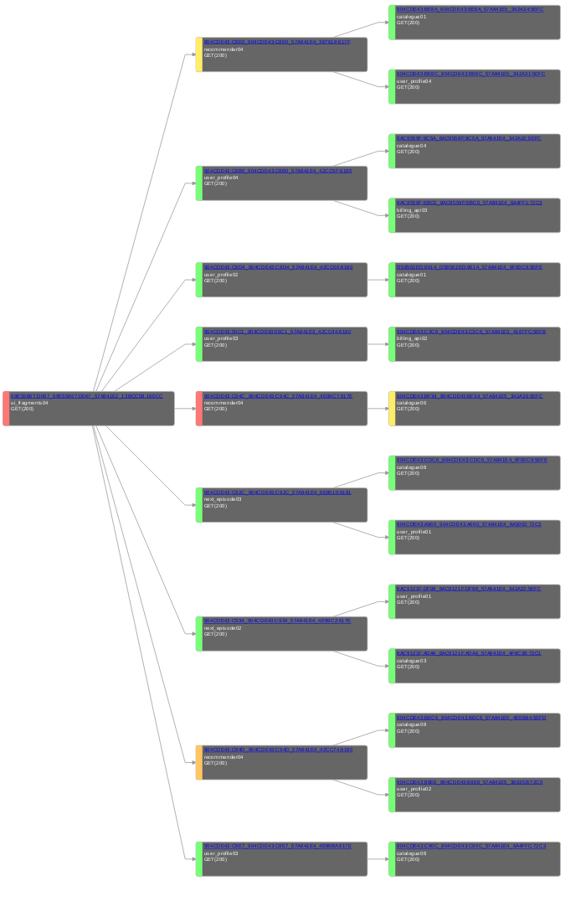

> This is a repost of [article for Showmax Tech Blog](https://tech.showmax.com/2016/10/tracing-distributed-systems-at-showmax/).

We have opted for a micro-service paradigm on our back-end. This means that different parts of the API accessible by end-user applications are handled by different services running on our application clusters. This type of distributed system is great for scaling, but it also brings challenges when one needs to troubleshoot a problem or understand dependencies between various services. Two main sources of complexity are dependencies between services and the fact that back-end services are moving between servers. Imagine that you need to go through multiple log files on multiple servers only to find that the request in question made another one which actually failed and you have to do all the searching again.

In this article, logging refers to the production, collection and storage of messages generated by the various components of our infrastructure. That includes load-balancers, application servers, application code or even user application. Tracing refers to the process of getting information about a request and its dependencies. Tracing utilises information collected via logging infrastructure to reconstruct call-graph and surface key information about the particular request.

## Logging
As mentioned, the first step in call-graph reconstruction is logging itself. To summarise, as the focus of this article is not to describe our logging infrastructure in detail, this consists of various log sources, message queues, log processors and storage. We have different types of storage engines. One of them is ElasticSearch, which makes logged events accessible via Kibana and other tools. The ElasticSearch cluster currently consists of 38 nodes and keeps roughly 30 days of messages.

Log messages are transported as JSON. That allows us to transform, filter, and add new fields easily. We have opted for JSON because of the  strong support base and schemaless.

## Tracing
Tracing is building on the top of logging. The simplest use-case for tracing is to be able to filter out all messages related to the particular request. We have achieved this by generating a unique ``request_id``. Our front-ends are HAProxies, so we’ve used built-in [``unique-id-format``](http://cbonte.github.io/haproxy-dconv/1.6/configuration.html#4-unique-id-format) and [``unique-id-header``](http://cbonte.github.io/haproxy-dconv/1.6/configuration.html#4.2-unique-id-header) to generate and inject ``request_id`` into every received API request. We kept the default:

       unique-id-format %{+X}o\ %ci:%cp_%fi:%fp_%Ts_%rt:%pid

Every component then injects the same ``request_id`` into every log message. This allows us to filter out all messages related to that specific request.

The next challenge is that while handling one request, a service may need to make multiple new calls to the API to fetch more information. As result we have introduced an ``origin_request_id`` field. It serves as a pointer to the request which made a call. An example could be a ``user_profile`` service needing to find the subscription status of the user from billing.

Having the ``origin_request_id`` allows us to reconstruct the call-graph (tree) for the particular request. call-graph reconstruction is a 2-step process:

  1. Find the root of the call-tree based on passed ``request_id``. This is an O(N) operation as we have to traverse back the branch.

  2. Start from found root call and descend through the complete tree to find all relevant requests. We need to make multiple requests to ES (one per level, as all requests on the same level share the same ``origin_request_id``).

Having to make several calls to ES to reconstruct call-tree is not ideal, but still feasible. Even quite complex trees can be reconstructed in less than three seconds. A drawback is that it is not easy to select all relevant events at once,which makes the troubleshooting process more labor intensive.

With that in mind, we recently optimised the process. We added a ``root_request_id`` which denotes the root of the call-tree and is replicated across all related calls:

This changes the call-graph reconstruction process as follows:

  1. Find the root of the call-tree based on passed ``request_id``. This is O(1) operation as we have to just fetch the starting request and look into the value of the ``root_request_id``.

  2. Select all requests from ES at once (as all of them share ``root_request_id``) and construct a graph.

### Call Tracer service
The next step was to build a simple web service that creates call-graphs. It combines a simple web service (written in Ruby using Sinatra framework) and a bit of D3 JavaScript trickery (inspired by [dagre-d3](https://github.com/cpettitt/dagre-d3)). You pass the ``request_id`` you want to start with, and it then fetches all relevant events and creates a call-graph. The result for complex calls are displayed in this fashion:

Every box represents one call. They are color-coded to show the latency of the particular request. Users can interact with the graph. request_id s are clickable and link back to Kibana. Users can also pan and zoom to read the details.

### Integration with Kibana
We went for a simple (yet powerful) integration with Kibana. Call Tracer links back to Kibana with a crafted search which selects all available information about the request. Kibana itself links to Call Tracer, allowing the user to get to call-graph quickly. This can be achieved in Kibana by going to settings and then selecting your index pattern. You can now search for index fields and change their properties. Find the one, which holds data, in our case request_id and

  * change the mapping of the string to Url,
  * provide custom Url mapping / template

## Summary

Distributed systems can be extremely hard to debug and troubleshoot. We’ve been able to significantly improve  the visibility of our micro-services via set of relatively simple components:

  * Inserting unique request identifier at the platform borders.
  * Keeping track of call-tree via request headers.
  * Centralised repository or logged events.
  * Simple web app to query central event repository and visualize call-tree.

Having such tools at our disposal has made troubleshooting much easier and encouraged our engineers to investigate potential problems and opportunities for optimisation.
