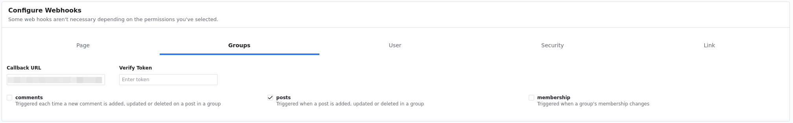
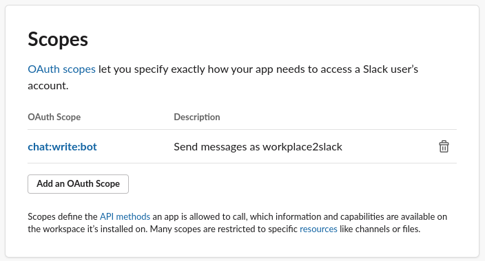
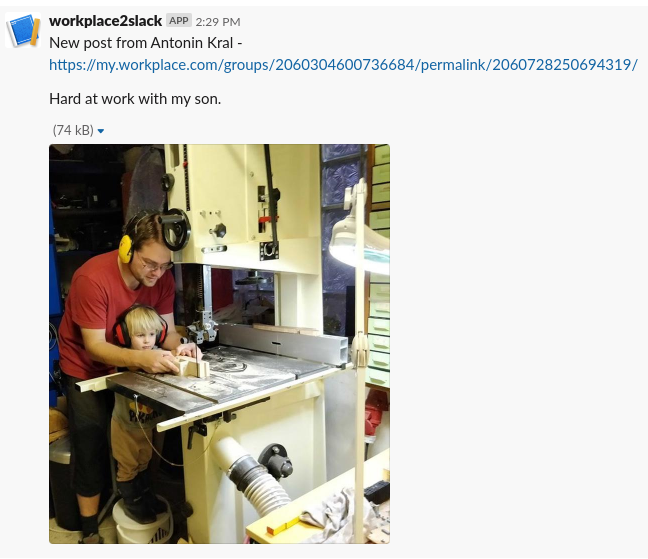

We are using Slack extensively at [work](https://dtone.engineering). But some parts of the company likes FB Workplace for posting updates. As we are [remote](https://handbook.dtone.engineering) company, we need to keep these type of information accessible. This lead to development of simple `workplace2slack` service. I've also got interested in Elixir, so I took this pet project as a good motivation for starting with it. Please note, that quite new to the language, so do your search before committing to stuff mentioned here.

Complete code is available at [github](https://github.com/bobek/workplace2slack).

## Getting started
### Initial Elixir project

I have decided not to use Phoenix as I wanted to explore `Plug` a bit more. Not sure, if that was necessary but just Elixir and Plug turned to be more then enough for this little project. I assume, that you have [Elixir already installed](https://elixir-lang.org/install.html).

Let's start with `mix new workplace2slack --sup` which will create a new Elixir project with preconfigured [supervision tree](https://hexdocs.pm/elixir/Supervisor.html). As we are building `http` API server, we need to add means of handling `http`. We will do that through `plug` (which is pluggable set of processors handling your request, similar to `rack` from Ruby world) and `cowboy` which is go to `http` server in Elixir world. We add project dependencies in `mix.exs`:

```elixir
  defp deps do
    [
      {:plug_cowboy, "~> 2.0"},
      {:jason, "~> 1.1"},
    ]
  end
```

I have also added [Jason](https://github.com/michalmuskala/jason) which is one of the Elixir JSON parser. We will use it for (de-)serialization of incoming and outgoing requests. Running `mix deps.get` wil fetch all missing dependencies for you.

#### Setting up basic routes

HTTP routing is facilitated with a router. We add one to `lib/slackolixir/router.ex`:

```elixir
defmodule Workplace2Slack.Router do
  use Plug.Router
  alias Workplace2Slack.Workplace
  require Logger

  plug :match
  plug Plug.RequestId
  plug Plug.Logger
  plug Plug.Parsers,
    parsers: [:json, :urlencoded],
    json_decoder: Jason
  plug :dispatch

  get "/health" do
    send_resp(conn, 200, "OK")
  end

  get "/workplace" do
    IO.inspect conn
    case conn.query_params["hub.challenge"] do
      challange when challange > 0 -> send_resp(conn, 200, challange)
      nil -> send_resp(conn, 200, "OK")
      _ -> send_resp(conn, 200, "OK")
    end
  end

  match _ do
    IO.inspect conn
    send_resp(conn, 404, "not found")
  end
end
```

Couple things happening here -- as you can see Router is Plug by itself and also defines plug pipeline (`:match`, `Plug.RequestId`, `Plug.Logger`, `Plug.Parsers`, `:dispatch`). The really needed are only `:match` and `:dispatch`. I am using others to:

- inject an unique `reques_id` or use one received in http header `X-Request-Id` it will also be added as metadata to Logger. This is done via `Plug.RequesId` plug.
- enable logging of requests through `Plug.Logger`. This will result in log messages like
```
07:43:00.314 request_id=fffe6acb5ab42be03aecef339a97f690 [info] POST /workplace
07:43:00.314 request_id=fffe6acb5ab42be03aecef339a97f690 [info] Sent 201 in 665µs
```
- `Plug.Parsers` will automatically parse request body and set e.g. `body_params` to for example Map. So we will not need to manually parse JSON bodies.

#### Start serving http requests

Last missing thing is to run http server as an entry point for our application. We do it at `lib/workplace2slack/application.ex` by adding a new child to our supervision tree:

```elixir
children = [
  {Plug.Cowboy, scheme: :http, plug: Workplace2Slack.Router, options: [port: Application.get_env(:workplace2slack, :port, 4000)]},
]
```

#### Setup Elixir releases

I want to use freshly stabilized [releases](https://elixir-lang.org/blog/2019/06/24/elixir-v1-9-0-released/). Go ahead and initialize releases with `mix release.init` and creating basic configuration file (I believe, it is needed to be sure, that Gigalixir picks up the fact, that you want to use `mix release`):

```bash
$ echo "import Config" > config/releases.exs
```

You should be able to run `mix release` which will create the release for your.

#### Testing it locally

We can now run our release with

```bash
_build/dev/rel/workplace2slack/bin/workplace2slack start
```

and make our first request

```bash
$ curl http://localhost:6000/health
OK
```

### Deploying to Gigalixir

I am using a free tier of [Gigalixir](https://www.gigalixir.com/) for deploying this project at the moment. We will create a `Dockerfile` in later stage to be able to deploy it to our infrastructure. But Gigalixir allows for super simple deployment (no affiliation :)). Just be aware, that you can specify region and provider when creating application with `gigalixir create`. I have not found a way how to change it later, so be sure, that you have picked the right one (I am in EU, so I went for `gcp` and `europe-west1` region).

We are now ready to deploy to Gigalixir. The requirement is to be able to respond to `/health` healthiness probes. Which we already have in our Router. You can monitor logs from your application with `gigalixir logs`.

## Facebook Workplace

First you will need to setup integration on the Workplace side. Go to [Integrations](https://my.workplace.com/work/admin/apps/) at your admin section and create a new custom integration. Allow `Read group content` permission and configure webhook  Also note your `App Secret`.

When you hit `Save`, Facebook will make a `GET` request to your defined endpoint to verify that you are able to respond. You can verify the shared challenge as well, which will get passed to the endpoint, so you can verify that it is coming from your integration. To confirm pairing, endpoint has to return value of `hub.challenge`.

> **Note:** This article is not trying to filter out messages or route messages from different groups to different channels. Our use-case for Workplace is so simple, that sending all message to one Slack channel is enough. Described setup may lead to **disclosure** of content from private groups!

## Slack bot

Got to your Slack and [create a new application](https://api.slack.com/apps). You need to do two things at your `OAuth & Permissions` screen:

1. Allow bot to post message with the `chat:write:bot` scope. 
1. Install the application to your workspace and note value of `OAuth Access Token`.

## Processing messages from Facebook Workplace

Now we have working service, which can receive events from the Workplace. Next, we want to parse them, and later on send them to Slack. The following code is probably beyond need for being split into module and multiple methods. But let's live with that for now. Add a new method to our router, which will handle `POST` from Workplace:

```elixir
post "/workplace" do
  # Verify that request came from Facebook
  Workplace2Slack.HubSignature.validate_request!(conn)

  with %{"entry" => [%{"changes" => [change|_]}|_], "object" => "group"} <- conn.body_params,
       %{"field" => "posts", "value" => %{"community" => %{"id" => _community_id}, "from" => %{"name" => author}, "message" => message, "permalink_url" => permalink_url}} <- change do

		# Parsing out any image attachments to be added to Slack message
    attachment_urls = case change do
      %{"field" => "posts", "value" => %{ "attachments" => %{"data" => attachments}}} -> Enum.flat_map(attachments, fn x -> Workplace.extract_image_url(x) end)
      _ -> []
    end
    images = attachment_urls
    |> List.flatten
    |> Enum.map(fn x -> %{type: "image", image_url: x, alt_text: "image"} end)

		# Assemble the Slack message, channel_id should really be in configuration
    slack_msg =
    %{
      as_user: false,
      channel: Application.get_env(:workplace2slack, :slack_channel),
      link_names: true,
      parse: "full",
      blocks: [
        %{
          type: "section",
          text: %{
            type: "mrkdwn",
            text: "New post from #{author} - #{permalink_url}",
          },
        },
        %{
          type: "section",
          text: %{
            type: "mrkdwn",
            text: Workplace.sanitize_message(message)
          },
         } | images ],
    }

    Logger.info("#{permalink_url} by #{author}")
		# Following line will send a "job" to job queue, will be covered in next section
    {:send_message, [slack_msg, Logger.metadata()[:request_id]]} |> Honeydew.async(:slack)
  end

  send_resp(conn, 201, "OK")
end
```

Function `Workplace.extract_image_url` is a little helper which parses out URLs of images attached to the original post. So those can be then attached to Slack notification message. Check the [`Workplace2Slack.Workplace`](https://github.com/bobek/workplace2slack/blob/master/lib/workplace2slack/workplace.ex) module for the actual implementation.

### Verifying that message came from Facebook

Every message from Facebook is signed with signature being carried in `X-Hub-Signature` http header. We definitely want to verify it, otherwise we would start posting spam to our Slack.

First of all, we need to get access to original body of the `POST` request. That is discarded by `Plug.Parser` during processing. Fortunately, an option for defining a [custom body parser](https://hexdocs.pm/plug/Plug.Parsers.html#module-custom-body-reader) has been recently added. We just need to extend our plug pipeline in router as follows:

```elixir
  plug Plug.Parsers,
    parsers: [:json, :urlencoded],
    body_reader: {Workplace2Slack.Plug.CacheBodyReader, :read_body, []},
    json_decoder: Jason
```

and define `CacheBodyReader` in `lib/plug/cache_body_reader.ex`:

```elixir
defmodule Workplace2Slack.Plug.CacheBodyReader do
  def read_body(conn, opts) do
    {:ok, body, conn} = Plug.Conn.read_body(conn, opts)
    conn = update_in(conn.assigns[:body_raw], &[body | (&1 || [])])
    {:ok, body, conn}
  end
end
```

This copies original body into `body_raw` attribute of the `conn` passed around. Which seems to be suboptimal solution, which may be reworked later on.

The actual validator is then called at the very top of message handled. My initial implementation was creating a custom `Plug` to do so, but then I realized that I really need it only for one call. Otherwise I would keep it and implement an option like `except_path` to disable it for certain routes. Code itself is straightforward and checks that `HMAC` signature of body and shared secret (that's the `App Secret` you can get from the Workplace integration screen) matches with value of the header. You can check [`Workplace2Slack.HubSignature`](https://github.com/bobek/workplace2slack/blob/master/lib/workplace2slack/hub_signature.ex) for the actual implementation.

## Sending messages to Slack

This could have been easily implemented as a [GenServer](https://elixir-lang.org/getting-started/mix-otp/genserver.html), but I wanted to explore proper job queue a bit. [Honeydew](https://github.com/koudelka/honeydew) seems to be quite popular within the community. Only gotcha is that default in-memory queue utilizes Mnesia, do [don't forget](https://github.com/koudelka/honeydew/issues/94) to add `:mnesia` into your `extra_applications` within `mix.exs` otherwise it will not get included into the release.

We will also need to add some dependencies, already mentioned `honeydew` and `httpoison` for making `http` calls towards Slack API. Just add the following to `deps` in your `mix.exs`:

```elixir
      {:httpoison, "~> 1.6"},
      {:honeydew, "~> 1.4"},
```

We just start a new queue and worker in our [`application.ex`](https://github.com/bobek/workplace2slack/blob/master/lib/workplace2slack/application.ex):

```elixir
    :ok = Honeydew.start_queue(:slack)
    :ok = Honeydew.start_workers(:slack, {Workplace2Slack.SlackWorker, [Application.get_env(:workplace2slack, :slack_token, "")]})
```

and also define worker [Workplace2Slack.SlackWorker](https://github.com/bobek/workplace2slack/blob/master/lib/workplace2slack/slack_worker.ex), which just send the message to Slack via their API. And that's it.

## Secrets and releases

As you may guess, I had a secrets (slack token and FB App Secret) hard-coded in the application configuration. It turns out, that releases makes live configuration much easier then with previous version of Elixir. Secret sauce is the fact that `config/releases.exs` will get *evaluated* when the release is going to be started. So the following (complete content of `config/releases.exs`) will do exactly what you expect:

```elixir
import Config

config :workplace2slack,
  slack_token: System.fetch_env!("SLACK_TOKEN"),
  fb_app_secret: System.fetch_env!("FB_APP_SECRET")
```

If you are running on Gigalixir, you can set your env with

```bash
gigalixir SLACK_TOKEN="secret_slack_token" FB_APP_SECRET="secret_fb_workplace_app_secret"
```

## Result

So next time, somebody posts an update to Workplace such


you will get a nice notification in your Slack channel



No need to have Workplace tab opened anymore!
