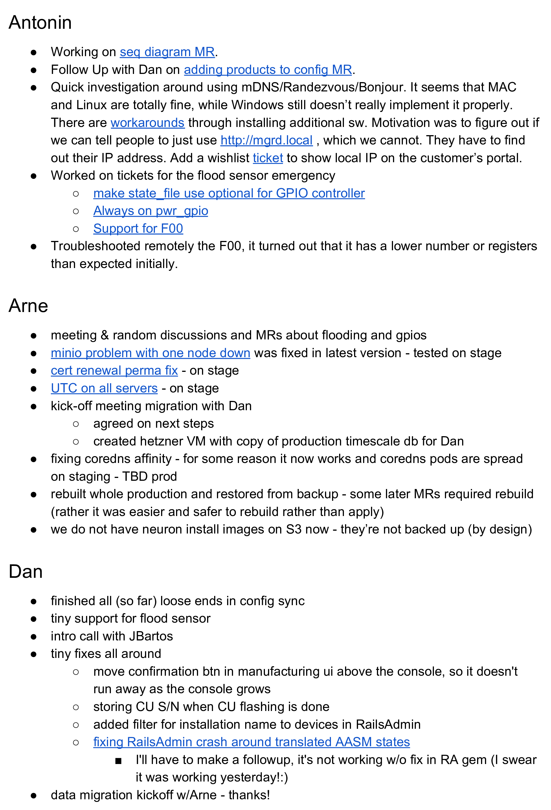

One of the most frequent used tool in agile teams (and not only there) is a daily standup. It typically looks like 10 minute meeting. Every team member has something like 1-2 minutes to go through what happened day before and what is the plan for the day.

Having a daily standup is an important part of knowledge sharing. That includes, but it is not limited to:

- what others are doing (to sync or avoid duplication, give opportunity to cooperate);
- express dependencies (e.g. I am waiting for some other event to happen before I can continue with my work);
- highlighting (semi-)important events, new projects, merge request (doesn't replace email for important notifications, but helps with spreading the information);
- highlighting interesting information sources (for example mentioning that interesting meeting happened and where are meeting minutes, mentioning an interesting article or task);
- status update about future plans (are we on track with our long-term goals, is some change in direction coming).

But physical standups (round tables) are frequently non-effective and actually quite hard to follow and don't give opportunity to dig deeper into topics which interests you. Also having a physical standup effectively prevents anybody from a different time-zone to participate. Not to mention, they frequently ends up as list of ticket numbers spitted out loud.

To address these issues, I have used concept of a **written standup** at multiple companies. 

## How written standup works?

Whole concept got its inspiration from a [long history of logbooks](https://en.wikipedia.org/wiki/Logbook).

- Bot creates an empty document every midnight UTC on the shared Google Drive (or any other collaborative storage). Bot follows naming schema of `{year}/{month}/{year}-{month}-{day}_standup`. Documents are made as copies of a template. Template is just a normal document. This allows to easily make changes to all future standups.
- Bot publishes the link to Slack channel `#engineering-standups`. Slack channel makes it really easy to get back couple standups. Which is quite handy for example when you get back from vacation.
- Everybody has her/his section in the document.
- Your record in the document should be finalized by the **end of your work day**. In other words -- you are supposed to be capturing what you have *done the same day* or what are you *planning to be doing next day*. It doesn't typically talk about yesterday (in contrast to typical standup).
- On the other hand, when you start working in the morning. Quickly go through the stand up from the **previous day**. That will help you to see what others have done.
- Always provide context to allow people to understand the update (links to Phabricator tasks, GitLab projects, merge requests or just link what ever you are talking about).
- If somebody asked a question / requested more details via comment, always consider updating your record in the document (in contrast to just replying to the comment). Any consecutive reader will benefit from the updated text.

Important thing is to keep common sense in the play. Cover information, which could be interesting for others. Not wasting time on trivial tasks. Always keeping on mind, that somebody else is going to read it.

 *Example page from a written standup document. Covering an IoT project.*

## Key benefits of written standups

- One can read way faster than listen/speak. So you can cover way more people when reading their notes.
- Having a links to additional resources give opportunity to dig a bit deeper and ask meaningful questions.
- Google Document allows for inline comments which became a great tool for asking additional information asynchronously.
- It is fair for everybody, despite their schedules or time-zones. It turned to be really valuable for every team, we have rolled this out to. It works for team in one time-zone as well as for teams distributed around the globe. Standup basically follows the sun.
- Allows people, who for any reason missed a particular standup, to catch up easily.
- Produces body of *searchable* and *rich* documents.
- It also helps you to see what you have achieved during the day. And get the sense of accomplishment, which is otherwise challenging to get at knowledge jobs.
- Best is to treat written standup as your logbook. Filling it during the day. It removes burden of remembering what you have done at the end of the day. As well as it allows for faster pickup by others.

## Adoption

Current experience is that people adopt the concept very quickly.

It is important to make sure, that people feel safe to share true notes. They may start filling in trivialities or even made up note, if they feel insecure. Leading by example really worked for me, so I am not afraid of making logs like the following one for myself.

> It has been a very slow/unproductive day with dentist and MD appointments. Then catching and responding to the slack on various threads.

