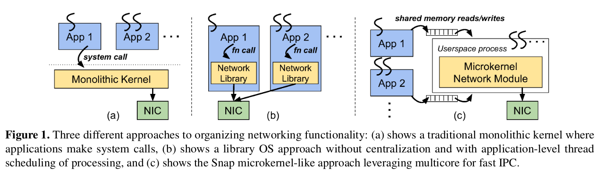

- [Rules of Machine Learning](https://developers.google.com/machine-learning/guides/rules-of-ml/)

    Discovered this just recently -- Google's Rules of Machine Learning. Key takeaway -- don't be afraid of starting with simple heuristic, introduce machine learning in a later stage.

- [The Maturing of QUIC](https://www.fastly.com/blog/maturing-of-quic)

    Nice write up summarizing current state of `QUIC` (together with `HTTbis` and `QPACK` also reffered to as `HTTP/3`). IETF is currently [working](https://github.com/quicwg/base-drafts/) on the first drafts of the standards.

- [Snap: a Microkernel Approach to Host Networking](https://ai.google/research/pubs/pub48630/)

    If you are Google, you need your own data-center communication protocol. 

    > Our evaluation demonstrates up to 3x improvement in Gbps/core efficiency, sub-10-microsecond latency, dynamic scaling capability, millions of one-sided operations per second, and CPU scheduling with a customizable emphasis between efficiency and latency.

- [Commandeering Kubernetes with Elixir](https://speakerdeck.com/coryodaniel/commandeering-kubernetes-with-elixir)

    Cory O’Daniel's talk at Big Elixir 2019 about writing Kubernetes Operator with Elixir. Source code is also [available](https://github.com/coryodaniel/talks/tree/master/commandeering/src)

- [Lexers and Parsers: Letting Business Write Business Logic](https://by.ben.church/Lexers-and-Parsers:-Letting-Business-Write-Business-Logic/)

    Into into using `leex` and `yecc` to parse custom grammar.

- [The Manager’s Schedule Is Holding Back Remote Work](https://marker.medium.com/the-managers-schedule-is-holding-remote-work-back-f9c1302ac6f3)

    Now, elephant in the room is -- people on the manager’s schedule tend to have a lot of leverage inside a company, but they also tend to dislike remote work.

- [GRIT Protocol Enables Distributed Transactions across Multi-Database Microservices](https://www.infoq.com/news/2019/10/eBay-grit-multidb-transactions/)

    > In environments that involve multiple independent databases, the traditional two-phase commit (2PC) protocol was essentially the only option for distributed transactions by the system without additional application effort. However, it does not work well in a scale-out platform due to long paths of potentially many coordinating participants and the locking required over the phases. On the other hand, using a transaction log executed by a framework such as Saga will incur complex compensating logic by applications and may have business implications due to irreversible partially successful transactions.
