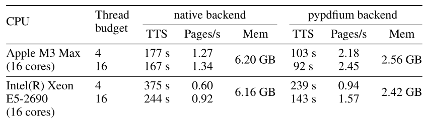

Top trending repository on GitHub today is [Docling](https://github.com/DS4SD/docling) version 2. Docling is a MIT licensed document parser, OCR and converter from IBM Deep Search Team. Their [technical report](https://arxiv.org/abs/2408.09869) details use of two specialized models -- `DocLayNet` for layout analysis and `TableFormer` for table structure recognition. They provide simple CLI tool as well as Python bindings.

Running the CLI is pretty easy with `vux` (I've recently started to switch from `pip` and `pipx` to [uv](https://github.com/astral-sh/uv):

```shell
uvx docling 2408.09869v3.pdf --to json --to md --to doctags --to text
```

This will generate all the (currently) supported output formats from the input PDF (which is Docling technical report). Report contains relatively complex table:



Docling's Markdown representation of the table is as follows. It is not perfect, as it handled the first (Apple silicon) row correctly, but the 2nd (Intel Xeon) row is not parsed incorrectly:

| CPU                   | Thread budget | native backend | native backend | native backend | pypdfium backend | pypdfium backend | pypdfium backend |
| --------------------- | ------------- | -------------- | -------------- | -------------- | ---------------- | ---------------- | ---------------- |
|                       | Thread budget | TTS            | Pages/s        | Mem            | TTS              | Pages/s          | Mem              |
| Apple M3 Max          | 4             | 177 s          | 1.27           | 6.20 GB        | 103 s            | 2.18             | 2.56 GB          |
| (16 cores)            | 16            | 167 s          | 1.34           | 6.20 GB        | 92 s             | 2.45             | 2.56 GB          |
| Intel(R) Xeon E5-2690 | 4 16          | 375 s 244 s    | 0.60 0.92      | 6.16 GB        | 239 s 143 s      | 0.94 1.57        | 2.42 GB          |

Python API allows for more control and access to functionality, check [usage](https://ds4sd.github.io/docling/usage/) and [Docling v2](https://ds4sd.github.io/docling/v2/) sections in their documentation. It allows for interesting things, like programmatic access to extracted tables for example (using `uv` in embedded script mode, which is super awesome):

```python
#!/usr/bin/env -S uv run
# /// script
# requires-python = ">=3.12"
# dependencies = [
#     "docling",
# ]
# ///

from docling.document_converter import DocumentConverter

converter = DocumentConverter()
result = converter.convert("https://arxiv.org/pdf/2408.09869")

table = result.document.tables[0]
df = table.export_to_dataframe()
print(df)
```

will produce the following output (same as the Markdown tables, as expected), as the table is extracted as pandas `DataFrame`:

```txt
                    CPU. Thread budget.Thread budget native backend.TTS  ... pypdfium backend.TTS pypdfium backend.Pages/s pypdfium backend.Mem
0           Apple M3 Max                           4              177 s  ...                103 s                     2.18              2.56 GB
1             (16 cores)                          16              167 s  ...                 92 s                     2.45              2.56 GB
2  Intel(R) Xeon E5-2690                        4 16        375 s 244 s  ...          239 s 143 s                0.94 1.57              2.42 GB

[3 rows x 8 columns]
```
