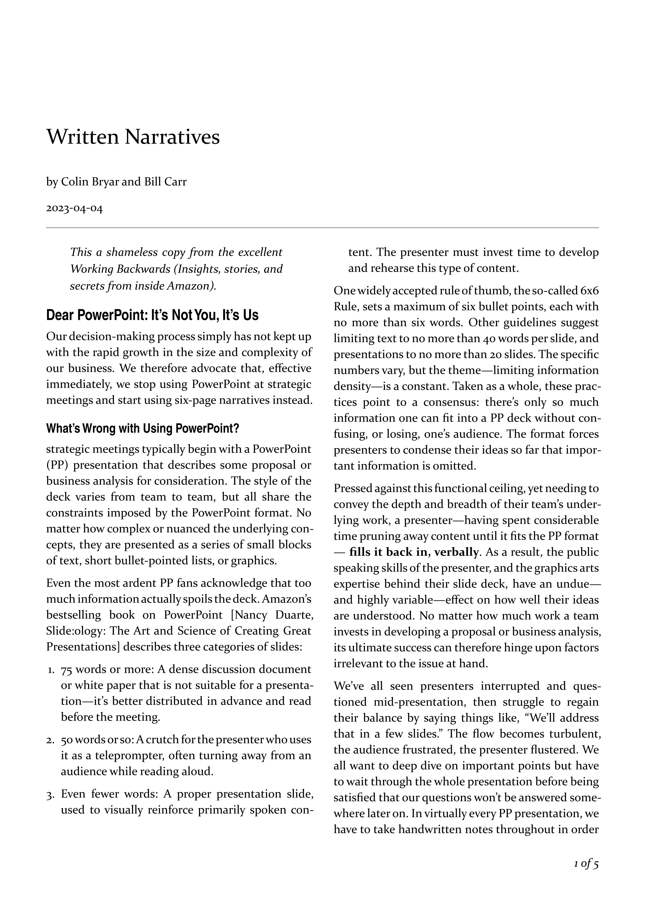

I've got a strong urge[[sidenote It all started with Jason Cohen's blog, where he [publishes nicely formatted PDFs](https://longform.asmartbear.com/slc/) for download and printing.]] to create a toolchain for producing nice two-column PDFs from Markdown sources. Also it was a good excuse to play with [Typst](https://typst.app/), which is a modern typesetting system[[sidenote Think about Typst as about LaTeX with way simpler syntax.]].

It turned out that multi-column typesetting is no easy task. But completely [new flow layout engine](https://github.com/typst/typst/pull/5017) was recently merged into Typst, which allowed closing of the long standing [feature request for multi-column support](https://github.com/typst/typst/issues/553). This new flow layout engine allows not only for setting the whole document to be multi-column, but also easily making a spread across the whole page:

```typst
#set page(columns: 2)

#place(
  top,
  scope: "parent",
  float: true,
  [#lorem(40)]
)

#figure(
  placement: auto,
  scope: "parent",
  caption: [Fake figure with caption],
  rect(width: 75%),
)

#lorem(600)
```

The only missing piece -- getting Typst source from Markdown file. [Pandoc](https://pandoc.org/) for the rescue. Pandoc has direct support for using Typst as a PDF backend. And also it supports custom templates for creating intermediate files, which are then used for conversion. Based on an excellent [write up by John Maxwell](https://imaginarytext.ca/posts/2024/pandoc-typst-tutorial/), I came up with the following Pandoc template.

```raw
// Pandoc template for creating PDF from a Markdown file with Typst.
// Based on work by John Maxwell, jmax@sfu.ca, July 2024
// Tweaks by Antonin Kral
// It assumes YAML metadata block with overrides like author, date, ...
//
// Usage:
//      pandoc source.md \
//      --wrap=none \
//      --pdf-engine=typst \
//      --template=pandoc_md_typst.template  \
//      -o output.pdf


#let conf(
  title: none,
  subtitle: none,
  authors: ((name: [your name here]),),
  date: datetime.today().display(),
  abstract: none,
  lang: "en",
  font: "Constantia",
  fontsize: 11pt,
  sectionnumbering: none,
  doc,
) = {
  set page(
    paper: "a4",
    columns: 2,
    margin: (x: 15mm),
    header: context {
        // Skip header on the first page
        if counter(page).at(here()).first() > 1 [
          #set text(size: 11pt, style: "italic")
          #align(right)[#title]
        ]
    },
    footer: [
      #set text(style: "italic")
      #align(right)[#context{counter(page).display("1 of 1", both: true,)}]
    ],
  )

  set text(lang: lang,
    font: font,
    size: fontsize,
    alternates: false,
  )

// Block quotations
//
  set quote(block: true)
  show quote: set block(spacing: 18pt)
  show quote: set pad(x: 2em)   // L&R margins
  show quote: set par(leading: 8pt)
  show quote: set text(style: "italic")


// Images and figures:
//
  set image(width: 5.25in, fit: "contain")
  show image: it => {
    align(center, it)
  }
  set figure(gap: 0.5em, supplement: none)
  show figure.caption: set text(size: 9pt)

// Code snippets:
//
  show raw: set block(inset: (left: 2em, top: 0.5em, right: 1em, bottom: 0.5em ))
  show raw: set text(fill: rgb("#116611"), size: 9pt) //green


// Footnote formatting
//
  set footnote.entry(indent: 0.5em)
  show footnote.entry: set par(hanging-indent: 1em)
  show footnote.entry: set text(size: 9pt, weight: 200)


// Headings
//
  show heading: set text(hyphenate: false)

  show heading.where(level: 1
    ):  it => align(left, block(above: 18pt, below: 11pt, width: 100% )[
        #set par(leading: 11pt)
        #set text(font: ("Helvetica", "Arial"), weight: "semibold", size: 14pt)
        #block(it.body)
      ])

  show heading.where(level: 2
    ): it => align(left, block(above: 18pt, below: 11pt, width: 80%)[
        #set text(font: ("Helvetica", "Arial"), weight: "semibold", size: 12pt)
        #block(it.body)
      ])

  show heading.where(level: 3
    ): it => align(left, block(above: 18pt, below: 11pt)[
        #set text(font: "Times New Roman", weight: "regular", style: "italic", size: 11pt)
        #block(it.body)
      ])

// Start of the document -- title etc.
// `place` will span the whole width of the page
//
  place(
    top,
    scope: "parent",
    float: true,
    [
      #v(48pt)
      #align(left, text(size: 20pt)[
        #set par(justify: false)
        #title])
      #v(4pt)
      #align(left, text(size: 16pt, style: "italic")[
        #set par(first-line-indent: 0em, justify: false)
        #subtitle])
      #v(3pt)
      #align(left, text(size: 11pt)[by #authors.first().name])
      #v(3pt)
      #align(left, text(size: 11pt)[#date])
      #v(2pt)
      #line(start: (0%,0%), end: (100%,0%), stroke: 1pt + gray)
      #v(2pt)
    ]
  )

  counter(page).update(1)
  set par(justify: true)
  doc // this is the actual content :)
}


// Finally, we assemble everything via Pandoc

#show: doc => conf(
$if(title)$
  title: [$title$],
$endif$
$if(subtitle)$
  subtitle: [$subtitle$],
$endif$
$if(author)$
  authors: (
$for(author)$
$if(author.name)$
    ( name: [$author.name$],
      affiliation: [$author.affil$],
      email: [$author.email$] ),
$else$
    ( name: [$author$],
      affiliation: [],
      email: [] ),
$endif$
$endfor$
    ),
$endif$
$if(date)$
  date: [$date$],
$endif$
$if(lang)$
  lang: "$lang$",
$endif$
$if(abstract)$
  abstract: [$abstract$],
$endif$
$if(section-numbering)$
  sectionnumbering: "$section-numbering$",
$endif$
  doc,
)

$if(toc)$
#outline(
  title: auto,
  depth: none
);
$endif$

$body$

$if(citations)$
$if(bibliographystyle)$

#set bibliography(style: "$bibliographystyle$")
$endif$
$if(bibliography)$

#bibliography($for(bibliography)$"$bibliography$"$sep$,$endfor$)
$endif$
$endif$
$for(include-after)$

$include-after$
$endfor$
```

Which produces this lovely PDF (only the first page is shown): 
